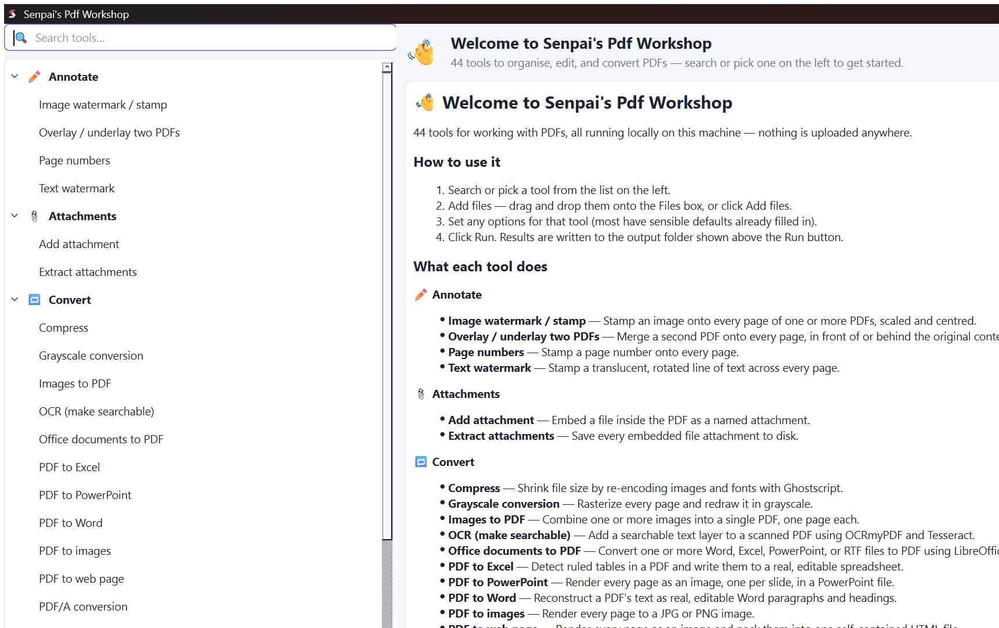

<div align="center">


# Senpai's Pdf Workshop

**44 local PDF tools. No upload, no account, no Docker, no page limits.**

Everything runs in the process on your own machine — a desktop window and a command
line, generated from the same 44-operation registry, with zero interface code
written per tool.

[](LICENSE)
[](pyproject.toml)
[](#packaging)
[](tests)

</div>

<p align="center">
  
</p>

## Contents

- [Why this exists](#why-this-exists)
- [Quick start](#quick-start)
- [What it can do](#what-it-can-do-44-operations)
- [How it is put together](#how-it-is-put-together)
- [Adding an operation](#adding-an-operation)
- [Licensing](#licensing--read-before-adding-a-dependency)
- [Packaging](#packaging)
- [Roadmap](#roadmap)

## Why this exists

Most "PDF tools" online are a web page with an upload button — your document leaves
your machine to get merged, split, or watermarked. Senpai's Pdf Workshop does the
same work locally: pypdf/pikepdf/pypdfium2 for the PDF internals, PySide6 for the
desktop window, and an architecture built around one idea — **an operation is
data, not code**. Every tool is one `@register(...)`-decorated function; the CLI,
the GUI's tool tree, and its parameter forms are all *generated* by walking that
registry. Adding tool #45 never means touching interface code.

## Quick start

```bash
git clone https://github.com/ArekatlaNishanthchowdary/senpais-pdf-workshop.git
cd senpais-pdf-workshop
python -m venv .venv && source .venv/bin/activate   # Windows: .venv\Scripts\activate
pip install -e ".[dev]"

senpai-gui                                  # desktop window
senpai merge a.pdf b.pdf -o ~/Desktop       # same operations from the shell
senpai extract report.pdf --pages 1-3,7,10-
pytest                                      # 75 tests, all green (a few skip
                                             # without Ghostscript/LibreOffice/extras)
```

Want the extra operations that need heavier optional dependencies (PDF → Excel /
Word / PowerPoint, OCR)? `pip install -e ".[dev,extras]"` — see
[Licensing](#licensing--read-before-adding-a-dependency) for exactly what that
pulls in and why it's kept optional.

Want a Windows installer instead of running from source? See
[Packaging](#packaging).

## What it can do (44 operations)

<details>
<summary><b>🗂️ Organise</b> (10) — merge, split, extract, remove, rotate, reverse, reorder, insert, split by count / by bookmarks</summary>

- **Merge PDFs** — Join several PDFs into one, in the order given.
- **Split into single pages** — Write every page of the document to its own file.
- **Extract pages** — Keep only the pages you select and discard the rest.
- **Remove pages** — Delete the pages you select and keep everything else.
- **Rotate pages** — Turn selected pages clockwise by a multiple of 90 degrees.
- **Reverse page order** — Put the last page first and the first page last.
- **Reorder pages** — Rearrange pages into the exact sequence you specify.
- **Insert PDF at a position** — Insert every page of one PDF into another at a given position.
- **Split by page count** — Break the document into chunks of a fixed number of pages.
- **Split by bookmarks** — Break the document into one file per top-level bookmark.
</details>

<details>
<summary><b>📐 Layout</b> (4) — crop, resize, N-up, booklet imposition</summary>

- **Crop pages** — Trim a fixed margin off every side of every page, in points.
- **Resize pages** — Scale every page to a standard size or by a percentage.
- **N-up (multiple pages per sheet)** — Lay out several source pages onto each output sheet.
- **Arrange as booklet** — Reorder and lay out pages two-up for folded, saddle-stitched printing.
</details>

<details>
<summary><b>✏️ Annotate</b> (4) — page numbers, text/image watermark, overlay/underlay</summary>

- **Page numbers** — Stamp a page number onto every page.
- **Text watermark** — Stamp a translucent, rotated line of text across every page.
- **Image watermark / stamp** — Stamp an image onto every page of one or more PDFs, scaled and centred.
- **Overlay / underlay two PDFs** — Merge a second PDF onto every page, in front of or behind the original content.
</details>

<details>
<summary><b>🏷️ Metadata</b> (2) — edit metadata, edit bookmarks</summary>

- **Edit metadata** — Set the title, author, subject, and keywords stored in the document.
- **Edit bookmarks** — Replace the document outline with the bookmarks you list.
</details>

<details>
<summary><b>📋 Forms</b> (2) — fill fields, flatten</summary>

- **Fill form fields** — Set the values of an AcroForm's fields, optionally flattening them in.
- **Flatten form fields** — Burn form field values into the page content and remove the interactive fields.
</details>

<details>
<summary><b>📎 Attachments</b> (2) — embed / extract file attachments</summary>

- **Add attachment** — Embed a file inside the PDF as a named attachment.
- **Extract attachments** — Save every embedded file attachment to disk.
</details>

<details>
<summary><b>📤 Extract</b> (3) — embedded images, plain text, XML dump</summary>

- **Extract embedded images** — Save every raster image embedded in the document to disk.
- **Extract plain text** — Save the readable text of the document to a .txt file.
- **PDF to XML** — Dump each page's text into a simple `<document><page>` XML structure.
</details>

<details>
<summary><b>🔒 Security</b> (5) — password add/remove, permissions, metadata strip, repair</summary>

- **Add a password** — Encrypt the document so it cannot be opened without the password.
- **Remove a password** — Save an unencrypted copy. You need the current password to do this.
- **Set permissions** — Restrict printing, copying, or editing without requiring a password to open.
- **Strip metadata** — Remove author, title, producer, and XMP metadata from the document.
- **Repair document** — Rewrite the file structure to fix damaged or non-conforming PDFs.
</details>

<details open>
<summary><b>🔁 Convert</b> (12) — PDF ↔ image/web/text, PDF → Word/Excel/PowerPoint, compress, PDF/A, OCR, Office → PDF</summary>

- **PDF to images** — Render every page to a JPG or PNG image.
- **Images to PDF** — Combine one or more images into a single PDF, one page each.
- **Grayscale conversion** — Rasterize every page and redraw it in grayscale.
- **Text file to PDF** — Lay out a plain text file as a paginated PDF.
- **PDF to web page** — Render every page as an image and pack them into one self-contained HTML file.
- **PDF to Excel** — Detect ruled tables in a PDF and write them to a real, editable spreadsheet.
- **PDF to Word** — Reconstruct a PDF's text as real, editable Word paragraphs and headings.
- **PDF to PowerPoint** — Render every page as an image, one per slide, in a PowerPoint file.
- **Compress** — Shrink file size by re-encoding images and fonts with Ghostscript.
- **PDF/A conversion** — Convert to the archival PDF/A format using Ghostscript.
- **OCR (make searchable)** — Add a searchable text layer to a scanned PDF using OCRmyPDF and Tesseract.
- **Office documents to PDF** — Convert one or more Word, Excel, PowerPoint, or RTF files to PDF using LibreOffice.
</details>

`PDF to Excel / Word / PowerPoint` and `OCR` need the optional `extras` install
(heavier dependencies — see [Licensing](#licensing--read-before-adding-a-dependency)).
`Compress`, `PDF/A conversion`, and `Office documents to PDF` need Ghostscript
and/or LibreOffice installed separately (or bundled via the
[Windows installer](#packaging)) — each detects the missing binary and raises a
clear error rather than failing to start.

## How it is put together

```
core/registry.py     Operation + Param dataclasses, the REGISTRY dict
core/pages.py        page-range parsing ("1-3,7,10-") and output naming
core/ops/organise.py merge, split, extract, remove, rotate, reverse, reorder,
                     insert, split by count / by bookmarks
core/ops/layout.py   crop, resize, N-up, booklet imposition
core/ops/annotate.py page numbers, text/image watermark, overlay/underlay
core/ops/document.py metadata, bookmarks, form filling/flattening
core/ops/attachments.py embed / extract file attachments
core/ops/extract_content.py embedded images, plain text, XML dump
core/ops/security.py password add/remove, permissions, metadata strip, repair
core/ops/images.py   PDF<->image, grayscale, text-to-PDF, PDF-to-web (pypdfium2 + Pillow)
core/ops/convert.py  compress, PDF/A, OCR, Office/RTF->PDF (Ghostscript/LibreOffice/Tesseract)
core/ops/tables.py   PDF to Excel via real table detection (camelot-py, `extras`)
core/ops/word.py     PDF to Word via positioned text (pdfplumber + python-docx, `extras`)
core/ops/slides.py   PDF to PowerPoint via one image per slide (python-pptx, `extras`)
core/ops/_draw.py    shared content-stream helpers (not an operation module)
core/ops/_binaries.py external-binary detection helper (not an operation module)
cli.py               argparse built by walking the registry
gui/app.py           PySide6 window; tool tree and forms built by walking the registry
```

The registry is the whole design. Operations are declared as **data** — id, label,
category, parameter list with types — and both front ends are generated from that
description. Neither `cli.py` nor `gui/app.py` mentions a single operation by name,
so the interface code stops growing once it is written. Getting from 10 operations
to 44 was then a matter of writing 34 small functions, which is a task you can hand
to contributors.

## Adding an operation

One function, one decorator. It appears in the CLI, the tool tree, and the form
builder with no further work.

```python
# core/ops/organise.py
@register(
    id="booklet",
    label="Arrange as booklet",
    category="Organise",
    summary="Reorder pages for folded double-sided printing.",
    params=(Param("sheets", "int", "Sheets per signature", default=4, minimum=1),),
)
def booklet(sources: list[Path], out_dir: Path, sheets: int = 4) -> list[Path]:
    ...
    return [target]
```

Rules the test suite enforces: summaries are full sentences, labels start with a
capital, `choice` parameters declare their options. Operations take
`(sources, out_dir, **params)` and return the list of files they wrote.

## Licensing — read before adding a dependency

The project is Apache-2.0. That is only sustainable if the dependency graph stays
permissive, and PDF tooling is unusually full of copyleft traps:

| Library | Licence | Use it? |
|---|---|---|
| pypdf | BSD-3 | Yes — default choice for page structure |
| pikepdf / QPDF | MPL-2.0 | Yes — encryption, repair, low-level objects |
| pypdfium2 | BSD-3 / Apache | Yes — rendering and rasterisation, core dependency |
| Pillow | HPND (permissive) | Yes — image decode/encode for stamps and image ops |
| cryptography | Apache-2.0 / BSD-3 | Yes — AES support for pypdf's reader |
| PySide6 | LGPL-3 | Yes — link dynamically, ship the licence text |
| PyMuPDF | AGPL-3 | **No** — it relicenses the whole project the moment it is imported |
| Ghostscript | AGPL-3 | Subprocess only, optional install (compress, PDF/A) |
| Tesseract / OCRmyPDF | Apache / MPL, GPL tools | `extras` group + subprocess, optional install |
| LibreOffice | MPL-2.0, huge | Subprocess only, optional install |
| camelot-py | MIT | Yes — `extras` group, table detection for PDF to Excel |
| openpyxl | MIT | Yes — `extras` group, writes the actual .xlsx |
| pandas / numpy | BSD-3 | Yes — `extras` group, camelot-py's own table-data dependencies |
| opencv-python-headless / playa-pdf | Apache-2.0 / MIT | Yes — `extras` group, camelot-py's own PDF/image dependencies |
| pdfplumber | MIT | Yes — `extras` group, positioned text for PDF to Word |
| python-docx / python-pptx | MIT | Yes — `extras` group, write the actual .docx / .pptx |
| xlsxwriter / lxml | BSD-2 / BSD-3 | Yes — `extras` group, python-pptx's own dependencies |

The rule: anything in `dependencies` must be permissive. AGPL and GPL tools are
allowed only as **separate processes** the user installs themselves, behind the
`extras` group, with the feature disabled and clearly labelled when absent.

Ship `LICENSE`, plus a `THIRD-PARTY-NOTICES.md` listing each dependency and its
licence. Add a `NOTICE` file if you accept contributions from employers.

## Packaging

A Windows installer is built in two steps: PyInstaller freezes the app, then
Inno Setup wraps it (plus, optionally, Ghostscript/LibreOffice/Tesseract) into
one `.exe`.

```bash
pip install pyinstaller
pyinstaller --windowed --name "SenpaisPdfWorkshop" \
  --icon src/senpais_pdf_workshop/gui/assets/icon.ico \
  --add-data "src/senpais_pdf_workshop/gui/assets;senpais_pdf_workshop/gui/assets" \
  --collect-submodules senpais_pdf_workshop.core.ops \
  packaging/run_gui.py
```

Two things that are easy to get wrong here, both already handled:

- `app.py` uses package-relative imports, so PyInstaller can't run it directly
  as a script — `packaging/run_gui.py` is a proper entry point instead.
- `load_operations()` discovers every `core/ops/*.py` module *dynamically* at
  runtime (`pkgutil.iter_modules`) — that's invisible to PyInstaller's static
  analysis, so without `--collect-submodules senpais_pdf_workshop.core.ops`
  the frozen app silently ships with an empty registry (0 tools, not a crash).

`packaging/installer.iss` (compile with
[Inno Setup](https://jrsoftware.org/isinfo.php)'s `ISCC.exe`) wraps the
PyInstaller output into a single installer that adds a Start Menu shortcut and
can optionally bundle Ghostscript/LibreOffice/Tesseract too — it detects each
one (by install path *and* PATH, since a plain install doesn't always add
itself to PATH) and only installs what's actually missing, then updates the
system PATH so the bundled operations work immediately. The third-party
installers themselves aren't committed to this repo (~460 MB, see
`.gitignore`) — `packaging/installer.iss` documents where to fetch them.

## Roadmap

**Not yet implemented, in order of value per hour of work:**

1. Drag-to-reorder page thumbnails in the GUI — the feature people actually miss
   (needs `pdf_to_image` under the hood, which now exists — this is pure GUI work)
2. Pipelines — chain operations; the registry already makes this nearly free
3. Batch mode, progress bars for long jobs, recent files list
4. Packaged builds (Win/Mac/Linux) in CI
5. THIRD-PARTY-NOTICES.md, CONTRIBUTING.md + issue templates
6. Real redaction — remove the content stream, not draw a black rectangle. Get
   this wrong and users leak the data they were trying to hide. Write the tests
   first.

**Deliberately deferred:** PDF → RTF, in-place text editing, cryptographic
signatures, document comparison, authoring brand-new form fields. LibreOffice's
own PDF import filter is too lossy to wire up as a PDF → RTF shortcut without
misleading users about what they'll get back.

**PDF → Word / PowerPoint / Excel — three different honesty levels, on purpose:**
- `PDF to Excel` (`core/ops/tables.py`, camelot-py) is the one that came out
  genuinely good: ruled tables are a mechanically detectable structure, so real
  cells land in a real spreadsheet, not a substitute.
- `PDF to Word` (`core/ops/word.py`, pdfplumber + python-docx) reconstructs real,
  editable paragraphs and guesses headings from line height — solid for
  text-heavy documents, rougher on multi-column or graphic-heavy layouts, since
  it's reading order, not a pixel clone.
- `PDF to PowerPoint` (`core/ops/slides.py`, python-pptx) is intentionally the
  least ambitious of the three: one rasterized image per slide, same honesty
  level as `PDF to web page`, because slides are a visual medium a text-reflow
  approach can't usefully reconstruct.

Note on `compress`, `pdf_to_pdfa`, and `office_to_pdf`: they shell out to
Ghostscript / LibreOffice, which this project does not bundle by default. Each
detects a missing binary and raises a clear error rather than failing to
import — see `core/ops/_binaries.py`. `ocr` needs the `extras` install (`pip
install "senpais-pdf-workshop[extras]"`) plus a Tesseract ≥ 4.1.1 install on PATH.
`office_to_pdf` takes a batch of mixed file types in one run (a `.docx` and a
`.pptx` together, say) — each is converted independently and de-duplicated by
name, so two source files that happen to share a stem never overwrite each
other.

---

<div align="center">

Built with [Claude Code](https://claude.com/claude-code).

</div>
